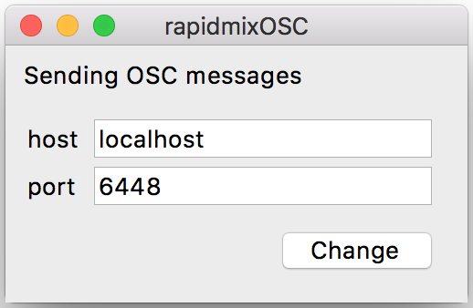

RAPIDMIX OSC middleware
======================

This software provides a way to stream OSC messages to and from a web browser using websockets. The principle is very simple:

Browser --(websocket)--> rapidmixOSC --(OSC)--> 3rd Party software

The default settings (port) are designed to match [Wekinator](http://www.wekinator.org/)'s.

**Author/contact**: panos.papiotis@upf.edu



Setup
-----

You can use a [pre-compiled binary](https://github.com/slowmountain/rapidmixOSC/releases) instead.

From source:


```
# virtualenv stuff (optional)
$ virtualenv env
$ . env/bin/activate

# installing libraries
(env)$ pip install -r requirements.txt

# running the server
(env)$ python rapidmixOSC.py #with GUI
(env)$ python rapidmixOSC.py --cli #without GUI
```


Usage
-----

(TODO)
The data is sent to the server and then as OSC messages to `localhost:6448` with the address `/rapidmix`
and the signals' values as arguments.

License
-------

    Copyright (C) 2017  Universitat Pompeu Fabra

    This program is free software: you can redistribute it and/or modify
    it under the terms of the GNU Affero General Public License as
    published by the Free Software Foundation, either version 3 of the
    License, or (at your option) any later version.

    This program is distributed in the hope that it will be useful,
    but WITHOUT ANY WARRANTY; without even the implied warranty of
    MERCHANTABILITY or FITNESS FOR A PARTICULAR PURPOSE.  See the
    GNU Affero General Public License for more details.

    You should have received a copy of the GNU Affero General Public License
    along with this program.  If not, see <http://www.gnu.org/licenses/>.
